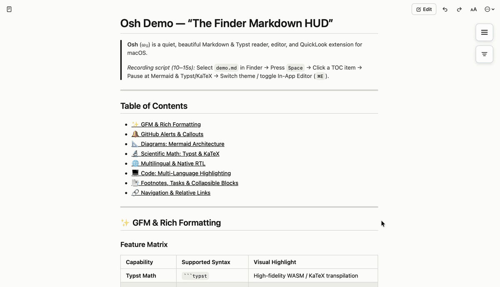

<p align="center">
  
  <h1 align="center">Osh <samp>ⲱϣ</samp></h1>
  <p align="center"><strong>A quiet, simple Markdown, AI .Skill files reader & QuickLook extension for macOS.</strong></p>
  <p align="center">
    <a href="https://github.com/Hyp4tia/Osh/releases"></a>
    <a href="https://github.com/Hyp4tia/Osh/stargazers"></a>
    <a href="https://github.com/Hyp4tia/Osh/blob/main/LICENSE"></a>
    
  </p>
  <p align="center">
    <a href="README.md">English</a> •
    <a href="README_ES.md">Español</a> •
    <a href="README_AR.md">العربية</a> •
    <a href="INSTALLATION.md">Installation</a> •
    <a href="FEATURES.md">Features</a> •
    <a href="COMPARISON.md">Comparison</a> •
    <a href="SHORTCUTS.md">Shortcuts</a> •
    <a href="Security_Audit.md">Security Audit</a>
  </p>
</p>

> [!NOTE]
> **Osh (v1.0.7)** — If you run into anything unexpected or have suggestions, please feel free to [open an issue](https://github.com/Hyp4tia/Osh/issues).

---

## What is Osh?

**Osh** (ⲱϣ) takes its name from the Coptic word for **“to read.”**

A native macOS Markdown reader, editor, and QuickLook extension designed for fast, beautiful, distraction-free reading.

Select any file in Finder, press `Space`, and get an instant, beautifully rendered preview with diagrams, mathematical notation, syntax highlighting, themes, and multilingual text support.

<p align="center">
  
</p>

---
## 📊 How Osh Compares

Osh focuses on **fast, local Markdown reading on macOS**, while other apps prioritize editing, customization, or automation.

### 📖 Core Experience

| Capability | **Osh** | FluxMarkdown | QLMarkdown | MacDown | Marked 2 | Typora |
|:---|:---:|:---:|:---:|:---:|:---:|:---:|
| Finder Quick Look | **✓** | ✓ | ✓ | — | — | — |
| Standalone reader | **✓** | ✓ | — | ✓ | ✓ | ✓ |
| Markdown editing | **✓** | ~ | — | **✓** | — | **✓** |
| AI `.skill` files | **✓** | — | — | — | — | — |
| Mermaid | **✓** | ✓ | ✓ | — | ✓ | ✓ |
| Math rendering | **✓** | ✓ | ✓ | ✓ | ✓ | ✓ |
| Typst math | **✓** | **✓** | — | — | — | — |
| RTL / BiDi support | **✓** | — | — | — | ~ | ~ |
| Charts & diagrams | **✓** | **✓** | ~ | — | ✓ | ✓ |
| Reading themes | **5** | 3 | CSS | CSS | Custom | **Extensive** |

### 🛠️ Export & Developer Features

| Capability | **Osh** | FluxMarkdown | QLMarkdown | MacDown | Marked 2 | Typora |
|:---|:---:|:---:|:---:|:---:|:---:|:---:|
| PDF export | **✓** | ✓ | — | — | **✓** | **✓** |
| HTML export | **✓** | ✓ | ✓ | ✓ | **✓** | **✓** |
| DOCX export | **✓** | ~ | — | — | **✓** | **✓** |
| Document conversion (PDF/DOCX/XLSX/PPTX/CSV → MD) | **✓** | — | — | — | — | ~ |
| CLI / automation | **✓** | — | ~ | — | **✓** | — |
| Public security documentation | **✓** | — | — | — | — | — |
| License | **GPL-3.0** | GPL-3.0* | GPL-2.0 | MIT | Proprietary | Proprietary |
| Price | **Free** | Free* | Free | Free | Paid | Paid |

### Why Osh?

- **Finder-first** — Preview Markdown instantly with `Space`.
- **AI-native** — Open and edit `.skill` files alongside Markdown documents.
- **Reader-first** — Built around reading, not just writing.
- **RTL-first** — Arabic and Hebrew are first-class layouts.
- **Scientific Markdown** — Mermaid, KaTeX, Typst, Vega-Lite, and Graphviz.
- **Security-focused** — Sanitization, CSP, path containment, and executable blocking.
- **Native-file-conversion** — Convert PDF, Excel, CSV, and DOCX files into agent-ready .md files, saving tokens and preserving context.

> **Comparison notes:** Features are based on publicly documented capabilities and project releases available at the time of writing. `—` means the capability was not found in the project's public documentation; it does not necessarily mean the software cannot provide it. `~` indicates partial or limited support. AI `.skill` support refers specifically to opening and editing `.skill` files as structured AI agent skill documents.
---

## ✨ Features

### ⚡ QuickLook & Reader
- **Finder QuickLook** — Preview Markdown instantly with `Space`.
- **Standalone Reader** — Search, zoom, navigate, and read distraction-free.
- **Source Editor** — Edit Markdown directly with `⌘E`.
- **Rendered / Source Views** — Switch between preview and source.
- **Packaged & Plain-Text `.skill` Support** — Full support for AI agent `.skill` packages (`SKILL.md`) and plain-text files with byte-for-byte asset preservation.

### 🎨 Reading Experience
- **System, Light & Dark Modes**
- **5 Reading Themes** — Default, Sepia, Paper, Midnight, Nord.
- **Adjustable Text Size**
- **High-Contrast Dark Mode**

### 📐 Math & Diagrams
- **Mermaid** — Flowcharts, sequence diagrams, Gantt charts, and more.
- **KaTeX & Typst** — Inline and block mathematical notation.
- **Vega-Lite** — Data visualizations.
- **Graphviz / DOT** — Graph and network diagrams.

### 🌐 Multilingual & RTL
- **Arabic & Hebrew RTL** — Bidirectional text and UI mirroring.
- **6 Languages** — English, Arabic, French, German, Spanish, Chinese.
- **Localized Help** — Guides follow your selected language.

### 🛠️ Writing & Export
- **Native macOS Toolbar**
- **Syntax Highlighting** — Multiple highlight.js themes.
- **GitHub Alerts & Task Lists**
- **Collapsible Blockquotes**
- **PDF, HTML & DOCX Export**

### 🛡️ Security & Privacy
- **HTML Sanitization** — DOMPurify-based sanitization.
- **Hardened CSP** — Restricts scripts and network access.
- **Path & Symlink Containment** — Prevents filesystem boundary escapes.
- **Executable Blocking** — Blocks dangerous application and script targets.
- **No Analytics or Telemetry**
- **Public Security Audit** - Because transparency is one of my core values.

> For implementation details and the current security status, see the [Security Audit](Security_Audit.md).

---

## 📁 Supported Formats & File Extensions

| Category | Extensions | Capabilities |
|:---|:---|:---|
| **Standard Markdown** | `.md`, `.markdown`, `.mdown`, `.mkdn`, `.mkd`, `.mdwn`, `.mdx` | QuickLook preview, source editor, diagrams, math, themes, offline export |
| **Scientific & Notebooks** | `.rmd`, `.qmd`, `.livemd` | R Markdown, Quarto, and Livebook rendered previews |
| **Documentation & Diagrams** | `.mdoc`, `.mdc`, `.mmd` | Modular docs, Markdown components, Mermaid diagrams |
| **Typst Documents** | `.typ` | Full Typst document and mathematical formula rendering |
| **AI Agent Skills** | `.skill` | Packaged & plain-text AI skills (`SKILL.md`) with asset preservation |
| **Document Conversion** | `.pdf`, `.docx`, `.xlsx`, `.pptx`, `.csv` | Client-side, offline conversion to agent-ready Markdown |

---

## 🚀 Installation

> [!NOTE]
> 🛡️ **Security & Privacy:** A full-codebase security audit is available in [Security_Audit.md](Security_Audit.md), covering static analysis, sandboxing, data handling, and security hardening.

### Download DMG

1. Download the latest **`Osh.dmg`** from the [GitHub Releases](https://github.com/Hyp4tia/Osh/releases) page.
2. Open the disk image and drag **Osh.app** into your **Applications** folder.
3. Launch Osh once from Applications to register the QuickLook extension with macOS.

> [!TIP]
> **Opening Osh on macOS for the first time**
>
> Osh is currently distributed outside the Mac App Store and is not yet notarized with an Apple Developer ID. macOS Gatekeeper may therefore show a warning that the developer cannot be verified.
>
> To open Osh:
>
> 1. Click **Done** on the warning.
> 2. Open **System Settings → Privacy & Security**.
> 3. Scroll to the **Security** section.
> 4. Look for the message indicating that Osh was blocked.
> 5. Click **Open Anyway**.
> 6. Confirm **Open**.
>
> This is normally required only on the first launch.

<details>
<summary><strong>Troubleshooting QuickLook after installation</strong></summary>

If pressing `Space` in Finder still shows plain text after installing:

1. Open **System Settings → Extensions → Quick Look** and ensure **Osh** is enabled.
2. If macOS cached an older QuickLook extension, run:

```bash
qlmanage -r
qlmanage -r cache
killall Finder
```
</details>

<p align="center">

## Contact

Built by Hyp4tia.  Reach out on <a href="https://x.com/Hypatox">X / Twitter</a>

</p>


<p align="center">
  <sub>Inspired by and partially based on <a href="https://github.com/xykong/flux-markdown">Flux-Markdown</a></sub><br>
  <sub>Document conversion powered by <a href="https://github.com/firecrawl/anydoc">Firecrawl AnyDoc</a></sub><br>
  <sub>All credit for original designs and upstream implementations goes to their respective authors and contributors.</sub>
</p>

