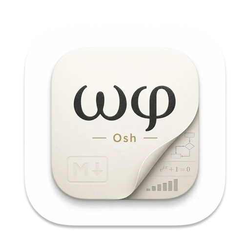

<p align="center">
  
  <h1 align="center">Osh <samp>ⲱϣ</samp></h1>
  <p align="center"><strong>قارئ Markdown ومعاينة QuickLook أنيق وهادئ لنظام macOS.</strong></p>
  <p align="center">
    <a href="https://github.com/Zeyadistired/Osh/releases"></a>
    <a href="https://github.com/Zeyadistired/Osh/stargazers"></a>
    <a href="https://github.com/Zeyadistired/Osh/blob/main/LICENSE"></a>
    
  </p>
  <p align="center">
    <a href="README.md">English</a> •
    <a href="README_ES.md">Español</a> •
    <a href="README_AR.md">العربية</a> •
    <a href="#التثبيت">التثبيت</a> •
    <a href="#المميزات">المميزات</a> •
    <a href="#اختصارات-لوحة-المفاتيح">الاختصارات</a> •
    <a href="Security_Audit.md">التدقيق الأمني</a>
  </p>
</p>

> [!NOTE]
> **تطبيق Osh حاليًا في مرحلة البيتا العامة (v1.0.4 Beta).** يجري العمل على صقل الميزات وتحسين الأداء باستمرار. إذا واجهتك أي مشكلة أو كان لديك اقتراح، يُرجى [فتح تذكرة على GitHub](https://github.com/Zeyadistired/Osh/issues)!

---

## ما هو Osh؟

**أوش** (ⲱϣ) كلمة قبطية قديمة تعني **«أن تقرأ»**.

على عكس برامج التحرير الثقيلة أو إضافات المتصفحات المعقدة، تم بناء Osh خصيصًا لنظام macOS لتقديم تجربة قراءة وتحرير Markdown سلسة ومريحة وخالية من التشتيت.

حدد أي ملف في Finder واضغط على **مسافة (Space)** للحصول على معاينة فورية ومصممة بأعلى جودة مع دعم المعادلات الرياضية، المخططات البيانية، وقوالب الألوان الهادئة.

<p align="center">
  
</p>

---

## ✨ المميزات الرئيسية

### ⚡ معاينة سريعة QuickLook وتطبيق مستقل
- **معاينة بضغطة زر**: عاين الملفات فورًا في Finder دون الحاجة لفتح تطبيقات خارجية.
- **معاينة أعمدة Finder**: تنسيق ديناميكي ملائم للوحة المعاينة الجانبية مع إمكانية ضبط حجم الخط.
- **عارض مستقل وقائمة الملفات الأخيرة**: تصفح الملفات مباشرة مع أدوات التكبير، البحث والتنقل السريع.
- **محرر نصوص Markdown مدمج**: إمكانية التبديل إلى وضع التحرير في أي وقت (`⌘E`) مع دعم كامل للكتابة باللغة العربية والاتجاه من اليمين لليسار.

### 🎨 5 قوالب قراءة متقنة
- **وضع النظام والوضع الفاتح والداكن**: يتوافق تلقائيًا مع نمط مظهر macOS.
- **قوالب مخصصة**: اختر بين **Default** و **Sepia** و **Paper** و **Midnight** و **Nord**.
- **تباين فائق في الوضع الداكن**: تباين لوني دقيق يضمن راحة العين والقراءة الواضحة في جميع البيئات.

### 📐 المخططات والمعادلات العلمية
- **مخططات Mermaid**: دعم كامل لتدفقات العمل، المخططات التسلسلية، وجداول Gantt.
- **معادلات KaTeX و Typst**: معادلات LaTeX الرياضية المضمنة والمنفصلة (`$E=mc^2$`) مع صيغ Typst الحديثة.
- **رسوم بيانية تفاعلية**: دعم رسوم Vega-Lite ومخططات Graphviz (DOT).

### 🌐 دعم أصيل للغة العربية والاتجاه من اليمين لليسار (RTL)
- **محاذاة كاملة للغة العربية**: معالجة ذكية للنصوص ثنائية الاتجاه مع دعم اللغة العربية والعبرية.
- **واجهة متعددة اللغات**: واجهة مترجمة بالكامل إلى العربية والإنجليزية والفرنسية والألمانية والإسبانية والصينية.
- **دليل مساعدة ذكي**: زر المساعدة في التطبيق ينقلك مباشرةً إلى الدليل المترجم بلغتك المختارة.

### 🛠️ راحة تامة للكاتب والمطور
- **شريط أدوات متكامل وبسيط**: وصول سريع للتبديل بين المعاينة والشفرة المصدرية، وضع التحرير، التراجع/الإعادة، ضبط حجم الخط، وخيارات التصدير.
- **تمييز الأكواد البرمجية**: تلوين syntax متقن للأكواد البرمجية مع قوالب جاهزة (GitHub, Monokai, Atom One Dark).
- **تنبيهات وقوائم مهام GitHub**: كتل التنبيهات المنسقة (`[!NOTE]`, `[!TIP]`) وقوائم المهام التفاعلية.
- **اقتباسات قابلة للطي**: إمكانية طي الاقتباسات الطويلة تلقائيًا لترتيب المستند.
- **تصدير بضغطة واحدة**: تصدير مستنداتك إلى **PDF** و **HTML** و **DOCX** بكامل التنسيقات.

---

## 🚀 التثبيت

> [!NOTE]
> 🛡️ **الأمان والخصوصية:** يمكنك الاطّلاع على تقرير التدقيق الأمني الشامل للشفرة المصدرية في [Security_Audit.md](Security_Audit.md).

### تحميل ملف DMG
1. حمّل أحدث ملف **`Osh.dmg`** من صفحة [الإصدارات على GitHub](https://github.com/Zeyadistired/Osh/releases).
2. افتح ملف DMG واسحب **Osh.app** إلى مجلد **التطبيقات (Applications)**.
3. شغّل تطبيق Osh مرة واحدة من التطبيقات لتسجيل إضافة QuickLook مع النظام.

> [!TIP]
> **فتح Osh لأول مرة على macOS (رسالة Gatekeeper):**
> نظرًا لأن التطبيق في مرحلة البيتا العامة ولم يتم توثيقه بعد بحساب مطور Apple رسمي، فقد تظهر رسالة من نظام الحماية Gatekeeper عند الفتح لأول مرة. لفتح التطبيق:
> 1. انقر على **تم (Done)** في الرسالة.
> 2. افتح **إعدادات النظام (System Settings)** ← **الخصوصية والأمان (Privacy & Security)**.
> 3. مرر لأسفل إلى قسم **الأمان (Security)**.
> 4. ستجد عبارة مثل *"تم حظر Osh من الاستخدام..."*.
> 5. انقر على **الفتح على أي حال (Open Anyway)**.
> 6. أكّد باختيار **فتح (Open)**.
>
> *(تحتاج للقيام بهذه الخطوة لمرة واحدة فقط عند التشغيل الأول).*

<details>
<summary><strong>استكشاف أخطاء المعاينة بعد التثبيت</strong></summary>

إذا استمر الضغط على `Space` في إظهار نص مجرد:
1. افتح **إعدادات النظام** ← **الملحقات** ← **Quick Look** وتأكد من تفعيل **Osh**.
2. لتحديث ذاكرة التخزين المؤقت لـ QuickLook، شغّل في Terminal:
   ```bash
   qlmanage -r
   qlmanage -r cache
   killall Finder
   ```
3. إذا ظهرت رسالة مطور غير معروف من Gatekeeper:
   ```bash
   xattr -cr /Applications/Osh.app
   ```
</details>

---

## ⌨️ اختصارات لوحة المفاتيح

| الاختصار | الإجراء |
|:---|:---|
| `Space` | فتح معاينة QuickLook في Finder |
| `⌘` + `E` | الدخول في / الخروج من وضع تحرير Markdown |
| `⇧` + `⌘` + `M` | التبديل بين المعاينة المنسقة والشفرة المصدرية |
| `⌘` + `Z` | تراجع عن التعديل (Undo) |
| `⇧` + `⌘` + `Z` | إعادة التعديل (Redo) |
| `⌘` + `+` / `⌘` + `-` | تكبير / تصغير حجم المستند |
| `⌘` + `0` | إعادة ضبط حجم الخط إلى الافتراضي |
| `⌘` + `R` | إعادة تحميل المستند من القرص |
| `⌘` + `F` | البحث في محتوى المستند |
| `⌘` + `⇧` + `P` | تصدير المستند كملف PDF |
| `⌘` + `⇧` + `E` | تصدير المستند كملف HTML |
| `⌘` + `⇧` + `D` | تصدير المستند كملف Word (DOCX) |
| `⌘` + `,` | فتح نافذة الإعدادات |
| `⌘` + `?` | فتح دليل المستخدم المترجم |

---

## 📁 الامتدادات المدعومة

يتعرف Osh تلقائيًا على مختلف امتدادات Markdown والصيغ العلمية:

```
.md  .markdown  .mdown  .mkdn  .mkd  .mdwn  .mdx  .rmd  .qmd  .mdoc  .mdc  .mmd  .livemd
```

---

## 🛠️ البناء من المصدر

المتطلبات: macOS 11+, Xcode, Node.js 18+, و `xcodegen` (`brew install xcodegen`).

```bash
# استنساخ المستودع
git clone https://github.com/Zeyadistired/Osh.git
cd Osh

# البناء والتثبيت محليًا
make install
```

---

## 📄 الترخيص وحقوق المصدر

- برنامج Osh مفتوح المصدر ومرخص تحت رخصة **[GPL-3.0 License](LICENSE)**.
- مبني ومطور استنادًا إلى مشروع [FluxMarkdown](https://github.com/xykong/flux-markdown) من قبل [@xykong](https://github.com/xykong) ومساهمي المجتمع.
