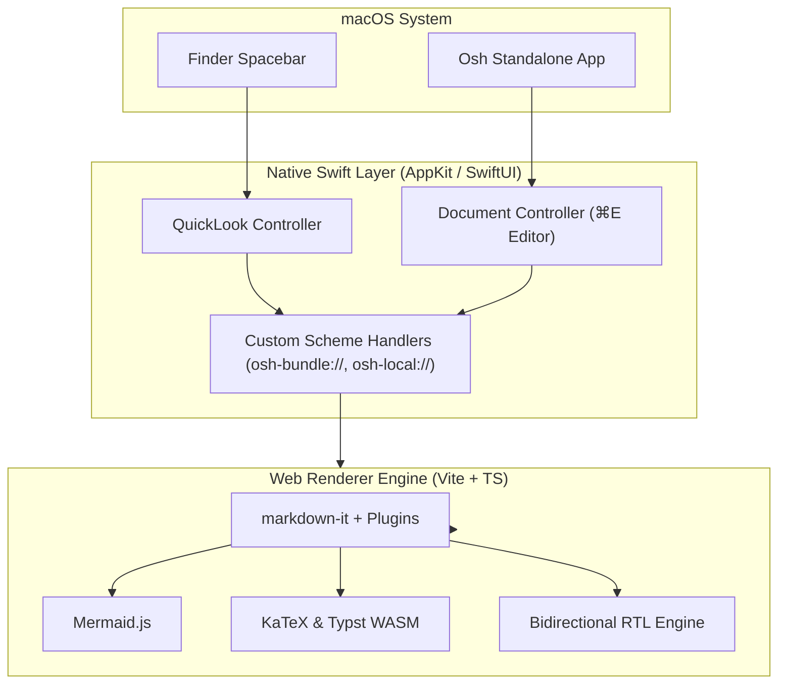

# Osh Demo — "The Finder Markdown HUD"

> **Osh** (<samp>ⲱϣ</samp>) is a quiet, beautiful Markdown & Typst reader, editor, and QuickLook extension for macOS.
> 
> *Recording script (10–15s):* Select `demo.md` in Finder → Press `Space` → Click a TOC item → Pause at Mermaid & Typst/KaTeX → Switch theme / toggle In-App Editor (`⌘E`).

---

## Table of Contents

- [✨ GFM & Rich Formatting](#-gfm--rich-formatting)
- [🔔 GitHub Alerts & Callouts](#-github-alerts--callouts)
- [📐 Diagrams: Mermaid Architecture](#-diagrams-mermaid-architecture)
- [🔬 Scientific Math: Typst & KaTeX](#-scientific-math-typst--katex)
- [🌐 Multilingual & Native RTL](#-multilingual--native-rtl)
- [💻 Code: Multi-Language Highlighting](#-code-multi-language-highlighting)
- [📑 Footnotes, Tasks & Collapsible Blocks](#-footnotes-tasks--collapsible-blocks)
- [🔗 Navigation & Relative Links](#-navigation--relative-links)

---

## ✨ GFM & Rich Formatting

### Feature Matrix

| Capability | Supported Syntax | Visual Highlight |
| :--- | :--- | :--- |
| **Typst Math** | ```` ```typst ```` | High-fidelity WASM / KaTeX transpilation |
| **Mermaid Charts** | ```` ```mermaid ```` | Flowcharts, Sequence, Class & Gantt diagrams |
| **GitHub Alerts** | `> [!NOTE]` / `> [!TIP]` | Color-coded callouts with icons |
| **Bidirectional RTL** | Native Arabic / Hebrew | Right-to-left layout with proper alignment |
| **Reading Themes** | 5 built-in palettes | Default, Sepia, Paper, Midnight, Nord |
| **In-App Editor** | `⌘E` hotkey | Live editing with split view & auto-save |

### Inline Styles

- **Highlighting**: Use ==highlighted markers== for key points.
- **Subscript & Superscript**: Water is H~2~O, and Einstein wrote $E = mc^2^$.
- **Strikethrough & Emphasis**: ~~Old text~~ replaced by *curated* **bold typography**.
- **Emojis**: 🚀 ⚡ 🎨 📐 🌐 🔍

---

## 🔔 GitHub Alerts & Callouts

> [!NOTE]
> Osh is built natively with Swift, SwiftUI, AppKit, and a bundled WebKit renderer for instant zero-lag launches.

> [!TIP]
> Press `⌘E` in the standalone viewer to switch seamlessly between reader mode and the source editor.

> [!IMPORTANT]
> Finder previews adapt automatically to macOS system appearance (Light / Dark mode).

> [!WARNING]
> Ensure security-scoped bookmark permissions are granted when opening documents across external volumes.

> [!CAUTION]
> Avoid running untrusted script tags inside arbitrary markdown files.

---

## 📐 Diagrams: Mermaid Architecture



---

## 🔬 Scientific Math: Typst & KaTeX

### Typst Math

```typst
sum_(k=1)^n k = (n(n+1))/2 quad "and" quad integral_0^infinity e^(-x^2) dif x = sqrt(pi)/2
```

```typst
mat(
  1, a, a^2;
  1, b, b^2;
  1, c, c^2;
)
```

### KaTeX LaTeX Equations

Inline: $\nabla \times \vec{\mathbf{B}} = \mu_0 \left( \vec{\mathbf{J}} + \varepsilon_0 \frac{\partial \vec{\mathbf{E}}}{\partial t} \right)$

Display Block:

$$
\mathcal{L} = \bar{\psi} (i \gamma^\mu D_\mu - m) \psi - \frac{1}{4} F_{\mu\nu} F^{\mu\nu}
$$

$$
\oint_C \mathbf{F} \cdot d\mathbf{r} = \iint_S (\nabla \times \mathbf{F}) \cdot d\mathbf{S}
$$

---

## 🌐 Multilingual & Native RTL

Osh provides full native support for Right-to-Left (RTL) scripts, automatically aligning paragraphs, blockquotes, and lists for Arabic and Hebrew documents:

> **أوش (Osh)** هو قارئ ومحرر ماركداون خفيف وسريع لنظام ماك.
> 
> - يدعم معاينة ملفات Markdown و Typst فوراً عبر زر المسافة في فايندر (QuickLook).
> - محاذاة تلقائية كاملة للنصوص والرموز الرياضية ثنائية الاتجاه.
> - سمات قراءة متعددة مريحة للعين مع دعم الوضع الداكن والفاتح.

---

## 💻 Code: Multi-Language Highlighting

### Swift (Native Bridge)

```swift
import SwiftUI
import WebKit

struct OshPreviewView: NSViewRepresentable {
    let documentURL: URL
    
    func makeNSView(context: Context) -> WKWebView {
        let configuration = WKWebViewConfiguration()
        configuration.setURLSchemeHandler(LocalSchemeHandler(), forURLScheme: "osh-local")
        return WKWebView(frame: .zero, configuration: configuration)
    }
    
    func updateNSView(_ nsView: WKWebView, context: Context) {}
}
```

### Rust (WASM Tooling)

```rust
pub fn format_document(source: &str) -> Result<String, OshError> {
    let parser = MarkdownParser::new(source);
    let mut rendered = String::with_capacity(source.len() * 2);
    parser.render_html(&mut rendered)?;
    Ok(rendered)
}
```

### Shell (Homebrew Quick Start)

```bash
# Install Osh via Homebrew Tap
brew install --cask Zeyadistired/tap/osh

# Reload QuickLook daemon
qlmanage -r
```

---

## 📑 Footnotes, Tasks & Collapsible Blocks

### Checklist

- [x] Zero configuration Markdown & Typst preview
- [x] Instant Finder Spacebar QuickLook HUD
- [x] 5 refined reading themes (Default, Sepia, Paper, Midnight, Nord)
- [x] Full math rendering with KaTeX and Typst WASM[^1]
- [x] Bidirectional text and RTL layout support[^2]
- [ ] Export directly to PDF, HTML, and Word Docx (`⌘⇧E`)

### Footnotes

[^1]: Typst math renders natively via `@myriaddreamin/typst.ts` WASM compiler in the host app and transpiles to KaTeX in QuickLook.
[^2]: Automatic direction detection per paragraph according to Unicode bidirectional character classification.

---

## 🔗 Navigation & Relative Links

- **Repository**: [GitHub — Zeyadistired/Osh](https://github.com/Zeyadistired/Osh)
- **Jump to Section**: [Back to Architecture Diagram](#-diagrams-mermaid-architecture)
- **Local File Link**: [Security Audit](../../Security_Audit.md)

---

<p align="center"><em>Osh (ⲱϣ) — Built with care for macOS.</em></p>
