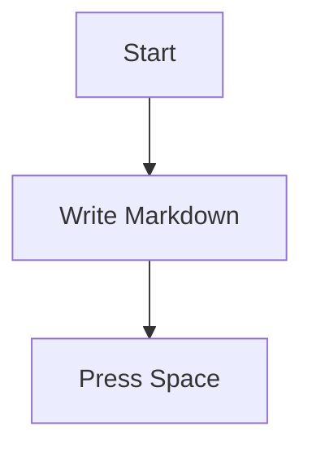

# Osh User Guide (Beginner-Friendly)

This guide is aimed at **everyday users**: get your first successful preview within one minute, then work through any problems from simplest to hardest.

> If you are a developer looking for lower-level details and command-line diagnostics, jump straight to:
> - Advanced troubleshooting: [`TROUBLESHOOTING.md`](TROUBLESHOOTING.md)

---

## 1) See that it really works

1. Find a `.md` file in Finder
2. Select it and press **Space**
3. You should see a styled Markdown preview (not plain text)

If that step worked, everything below is optional.

---

## 2) First-time setup (recommended flow)

### Step A: Launch the app once (important)

macOS usually only registers a QuickLook extension after its host app has been opened at least once.

1. Open **Applications**
2. Launch **Osh** once
3. Seeing the welcome window is enough (no need to pick a file)

### Step B: Make sure the Quick Look extension is enabled

If pressing Space still shows the old preview:

1. Open **System Settings**
2. Go to **Extensions** → **Quick Look**
3. Make sure the **Osh / OshQuickLook** item is enabled

---

## 3) Common issues (simple → hard)

### 3.1 Pressing Space still "does nothing"

Try each of these in order:

1. **Restart Finder**: right-click the Finder icon in the Dock (holding Option makes this more reliable) → Relaunch
2. **Clear the QuickLook cache**: open Terminal and run:

```bash
qlmanage -r
qlmanage -r cache
killall Finder
```

Then go back to Finder and press Space again.

### 3.2 "App is damaged / can't verify the developer"

This is macOS Gatekeeper kicking in (downloaded apps carry a quarantine flag).

Run this in Terminal:

```bash
xattr -cr "/Applications/Osh.app"
```

Then open the app again.

### 3.3 Preview opens, but occasionally shows plain text

Usually the system picked another QuickLook plugin or has a stale cache.

1. Clear the cache following steps in **3.1** first
2. Optionally make Osh the default handler for `.md`: right-click the file → Get Info → Open with

If it remains unreliable, see the advanced guide: [`TROUBLESHOOTING.md`](TROUBLESHOOTING.md)

---

## 4) Using the app (open files / drag & drop / settings)

### Opening files

- Option 1: double-click a `.md` file (if Osh is the default handler)
- Option 2: click the **+** in the middle of the welcome window and choose a file
- Option 3: drag a file straight onto the **+** area of the welcome window

### Opening Settings

- Keyboard shortcut: **Cmd + ,**
- Or click **Open Settings** in the welcome window

---

## 5) Tips: writing Markdown that previews beautifully

Osh supports Mermaid, KaTeX, GFM and more. Here are a few copy-paste examples:

### Mermaid



### KaTeX

Inline: `$E = mc^2$`

Block:

```tex
\int_a^b f(x)\,dx
```

---

## 6) Still need help?

1. Read the advanced troubleshooting guide (more detailed checks and explanations): [`TROUBLESHOOTING.md`](TROUBLESHOOTING.md)
2. If you'd like to report a problem:
   - GitHub Issues: <https://github.com/Zeyadistired/Osh/issues>
