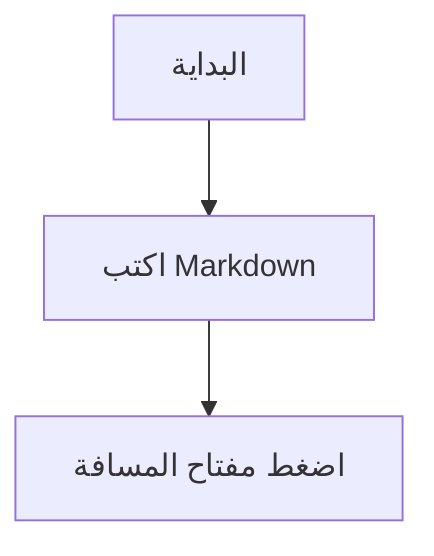

# دليل مستخدم Osh (للمبتدئين)

هذا الدليل موجه إلى **المستخدمين اليوميين**: احصل على أول معاينة ناجحة لك في أقل من دقيقة، ثم استكشف أي مشاكل من الأبسط إلى الأكثر تعقيدًا.

> إذا كنت مطورًا وتبحث عن تفاصيل وتشخيصات سطر الأوامر، فانتقل مباشرة إلى:
> - استكشاف الأخطاء المتقدم: [`TROUBLESHOOTING.md`](TROUBLESHOOTING.md)

---

## 1) تحقق من عمله مباشرة

1. حدد أي ملف `.md` في تطبيق Finder
2. اضغط على مفتاح **المسافة (Space)**
3. يجب أن ترى معاينة Markdown منسقة وأنيقة (وليس نصًا مجردًا)

إذا نجحت هذه الخطوة، فكل ما يلي اختياري.

---

## 2) الإعداد لأول مرة (المسار الموصى به)

### الخطوة أ: افتح التطبيق مرة واحدة (مهم)

يقوم نظام macOS عادةً بتسجيل إضافة Quick Look فقط بعد فتح التطبيق الرئيسي لمرة واحدة على الأقل.

1. افتح مجلد **التطبيقات (Applications)**
2. شغّل تطبيق **Osh** مرة واحدة
3. ظهور نافذة الترحيب كافٍ (لا يلزم اختيار ملف)

### الخطوة ب: تأكد من تفعيل إضافة Quick Look

إذا استمر الضغط على مفتاح المسافة في إظهار المعاينة القديمة:

1. افتح **إعدادات النظام (System Settings)**
2. انتقل إلى **الملحقات (Extensions)** ← **Quick Look**
3. تأكد من تفعيل عنصر **Osh / MarkdownPreview**

---

## 3) المشاكل الشائعة (من الأبسط إلى الأكثر تقدمًا)

### 3.1 الضغط على مفتاح المسافة لا يُظهر شيئًا

جرّب هذه الخطوات بالترتيب:

1. **أعد تشغيل Finder**: انقر بزر الفأرة الأيمن على أيقونة Finder في شريط Dock (مع الضغط المطول على Option) ← إعادة التشغيل (Relaunch)
2. **امسح ذاكرة تخزين QuickLook المؤقتة**: افتح Terminal وشغّل:

```bash
qlmanage -r
qlmanage -r cache
killall Finder
```

ثم عد إلى Finder واضغط مفتاح المسافة مجددًا.

### 3.2 «التطبيق تالف / لا يمكن التحقق من المطور»

هذا فحص أمان Gatekeeper الخاص بنظام macOS.

شغّل هذا الأمر في Terminal:

```bash
xattr -cr "/Applications/Osh.app"
```

ثم افتح التطبيق مجددًا.

### 3.3 المعاينة تفتح، لكنها تعرض نصًا عاديًا أحيانًا

عادة ما يكون النظام قد اختار إضافة QuickLook أخرى أو أن الذاكرة المؤقتة قديمة.

1. امسح الذاكرة المؤقتة باتباع الخطوة **3.1** أولاً
2. اختياريًا، اجعل Osh التطبيق الافتراضي لفتح ملفات `.md`: انقر بزر الفأرة الأيمن على الملف ← إحضار المعلومات (Get Info) ← فتح باستخدام (Open with)

إذا استمرت المشكلة، راجع دليل استكشاف الأخطاء المتقدم: [`TROUBLESHOOTING.md`](TROUBLESHOOTING.md)

---

## 4) استخدام التطبيق (فتح الملفات / السحب والإفلات / الإعدادات)

### فتح الملفات

- الخيار 1: انقر نقرًا مزدوجًا على ملف `.md`
- الخيار 2: انقر على **+** في منتصف نافذة الترحيب واختر ملفًا
- الخيار 3: اسحب الملف وأفلته مباشرة في نافذة الترحيب

### فتح الإعدادات

- اختصار لوحة المفاتيح: **Cmd + ,**
- أو انقر على **الإعدادات (Settings)** في أسفل نافذة الترحيب

---

## 5) نصائح: كتابة Markdown بتنسيق جذاب

يدعم Osh مخططات Mermaid وصيغ KaTeX وGFM والمزيد:

### مخططات Mermaid



### معادلات KaTeX

مضمنة: `$E = mc^2$`

كتلة معادلة:

```tex
\int_a^b f(x)\,dx
```

---

## 6) هل ما زلت بحاجة إلى مساعدة؟

1. اقرأ دليل استكشاف الأخطاء المتقدم: [`TROUBLESHOOTING.md`](TROUBLESHOOTING.md)
2. للإبلاغ عن مشكلة:
   - مشكلات GitHub: <https://github.com/Zeyadistired/Osh/issues>
