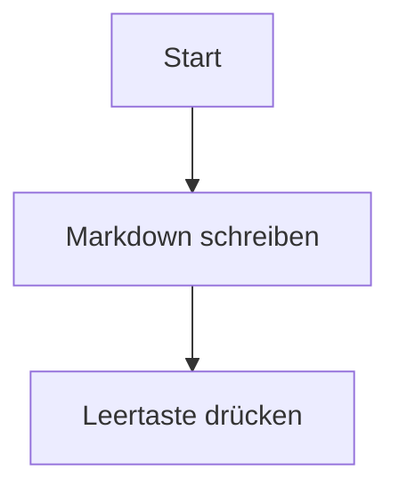

# Osh-Benutzerhandbuch (Einsteigerfreundlich)

Dieses Handbuch richtet sich an **alltägliche Benutzer**: Erhalten Sie Ihre erste erfolgreiche Vorschau in unter einer Minute und beheben Sie etwaige Probleme vom einfachsten bis zum anspruchsvollsten.

> Wenn Sie als Entwickler tiefergehende Diagnosen oder Befehlszeilenwerkzeuge suchen, schauen Sie direkt hier:
> - Erweiterte Fehlerbehebung: [`TROUBLESHOOTING.md`](TROUBLESHOOTING.md)

---

## 1) Testen Sie die Funktion

1. Wählen Sie eine `.md`-Datei im Finder aus
2. Drücken Sie die **Leertaste**
3. Sie sollten eine formatierte Markdown-Vorschau sehen (keinen reinen Text)

Wenn dieser Schritt geklappt hat, ist alles Weitere optional.

---

## 2) Ersteinrichtung (Empfohlener Ablauf)

### Schritt A: Öffnen Sie die App einmalig (wichtig)

macOS registriert eine QuickLook-Erweiterung in der Regel erst, nachdem die Host-App mindestens einmal geöffnet wurde.

1. Öffnen Sie den Ordner **Programme**
2. Starten Sie **Osh** einmalig
3. Das Willkommensfenster reicht bereits aus (keine Dateiauswahl erforderlich)

### Schritt B: Stellen Sie sicher, dass die QuickLook-Erweiterung aktiviert ist

Falls das Drücken der Leertaste weiterhin die alte Vorschau zeigt:

1. Öffnen Sie die **Systemeinstellungen**
2. Gehen Sie zu **Erweiterungen** → **Quick Look**
3. Stellen Sie sicher, dass **Osh / OshQuickLook** aktiviert ist

---

## 3) Häufige Probleme (einfach → anspruchsvoll)

### 3.1 Leertaste bewirkt „gar nichts“

Probieren Sie die folgenden Schritte der Reihe nach aus:

1. **Finder neu starten**: Rechtsklick auf das Finder-Symbol im Dock (Option-Taste gedrückt halten) → Neu starten
2. **QuickLook-Cache leeren**: Terminal öffnen und ausführen:

```bash
qlmanage -r
qlmanage -r cache
killall Finder
```

Anschließend im Finder erneut die Leertaste drücken.

### 3.2 „App ist beschädigt / Entwickler kann nicht verifiziert werden“

Dies ist die macOS Gatekeeper-Sicherheitsüberprüfung.

Führen Sie im Terminal Folgendes aus:

```bash
xattr -cr "/Applications/Osh.app"
```

Öffnen Sie die App anschließend erneut.

### 3.3 Vorschau öffnet sich, zeigt aber manchmal reinen Text

In der Regel hat das System ein anderes QuickLook-Plugin bevorzugt oder verwendet einen veralteten Cache.

1. Leeren Sie den Cache wie in **3.1** beschrieben
2. Setzen Sie Osh optional als Standard-App für `.md`-Dateien: Rechtsklick auf die Datei → Informationen → Öffnen mit

Weitere Hilfe finden Sie im erweiterten Leitfaden: [`TROUBLESHOOTING.md`](TROUBLESHOOTING.md)

---

## 4) App-Bedienung (Dateien öffnen / Drag & Drop / Einstellungen)

### Dateien öffnen

- Option 1: Doppelklick auf eine `.md`-Datei
- Option 2: Klick auf das **+** in der Mitte des Willkommensfensters
- Option 3: Datei direkt auf das Willkommensfenster ziehen

### Einstellungen öffnen

- Tastaturkurzbefehl: **Cmd + ,**
- Oder Klick auf **Einstellungen** im Willkommensfenster

---

## 5) Tipps: Markdown mit schöner Formatierung verfassen

Osh unterstützt Mermaid, KaTeX, GFM und vieles mehr:

### Mermaid



### KaTeX

Inline: `$E = mc^2$`

Block:

```tex
\int_a^b f(x)\,dx
```

---

## 6) Benötigen Sie weitere Hilfe?

1. Lesen Sie das Handbuch zur erweiterten Fehlerbehebung: [`TROUBLESHOOTING.md`](TROUBLESHOOTING.md)
2. Problem melden:
   - GitHub Issues: <https://github.com/Zeyadistired/Osh/issues>
