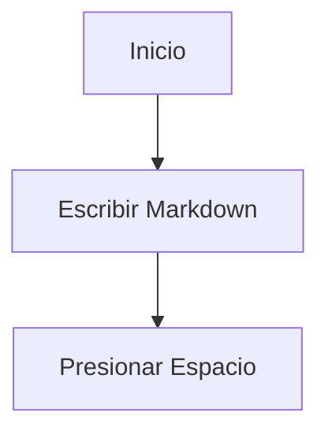

# Guía de Usuario de Osh (Principiantes)

Esta guía está dirigida a **usuarios diarios**: obtenga su primera vista previa con éxito en menos de un minuto y resuelva cualquier problema del más simple al más avanzado.

> Si es desarrollador y busca diagnósticos de línea de comandos o detalles avanzados, consulte directamente:
> - Solución avanzada de problemas: [`TROUBLESHOOTING.md`](TROUBLESHOOTING.md)

---

## 1) Compruebe que funciona

1. Busque un archivo `.md` en el Finder
2. Selecciónelo y presione la **barra espaciadora**
3. Debería ver una vista previa estilizada de Markdown (no texto sin formato)

Si este paso funcionó, todo lo que sigue es opcional.

---

## 2) Configuración inicial (recomendada)

### Paso A: Abra la aplicación una vez (importante)

macOS generalmente solo registra una extensión de QuickLook después de que su aplicación principal se haya abierto al menos una vez.

1. Abra **Aplicaciones**
2. Inicie **Osh** una vez
3. Ver la ventana de bienvenida es suficiente (no es necesario elegir un archivo)

### Paso B: Asegúrese de que la extensión de Quick Look esté activada

Si al presionar la barra espaciadora todavía aparece la vista previa antigua:

1. Abra **Ajustes del Sistema**
2. Vaya a **Extensiones** → **Quick Look**
3. Asegúrese de que el elemento **Osh / MarkdownPreview** esté activado

---

## 3) Problemas comunes (de simple a avanzado)

### 3.1 La barra espaciadora no hace nada

Pruebe cada uno de estos pasos en orden:

1. **Reinicie el Finder**: clic derecho en el icono del Finder en el Dock (manteniendo presionada la tecla Option) → Reiniciar
2. **Borre la caché de QuickLook**: abra Terminal y ejecute:

```bash
qlmanage -r
qlmanage -r cache
killall Finder
```

Luego regrese al Finder y presione la barra espaciadora nuevamente.

### 3.2 «La aplicación está dañada / no se puede verificar el desarrollador»

Es la protección Gatekeeper de macOS.

Ejecute esto en Terminal:

```bash
xattr -cr "/Applications/Osh.app"
```

Luego vuelva a abrir la aplicación.

### 3.3 La vista previa se abre, pero a veces muestra texto sin formato

Por lo general, el sistema eligió otro complemento de QuickLook o tiene una caché obsoleta.

1. Borre la caché siguiendo el paso **3.1** primero
2. Opcionalmente, establezca Osh como la aplicación predeterminada para archivos `.md`: clic derecho en el archivo → Obtener información → Abrir con

Si el problema persiste, consulte la guía avanzada: [`TROUBLESHOOTING.md`](TROUBLESHOOTING.md)

---

## 4) Uso de la aplicación (abrir archivos / arrastrar y soltar / ajustes)

### Abrir archivos

- Opción 1: haga doble clic en un archivo `.md`
- Opción 2: haga clic en el **+** en el centro de la ventana de bienvenida
- Opción 3: arrastre un archivo directamente a la ventana de bienvenida

### Abrir ajustes

- Atajo de teclado: **Cmd + ,**
- O haga clic en **Ajustes** en la parte inferior de la ventana de bienvenida

---

## 5) Consejos: redacción de Markdown con estilo

Osh es compatible con Mermaid, KaTeX, GFM y más:

### Mermaid



### KaTeX

En línea: `$E = mc^2$`

Bloque:

```tex
\int_a^b f(x)\,dx
```

---

## 6) ¿Aún necesita ayuda?

1. Lea la guía avanzada de solución de problemas: [`TROUBLESHOOTING.md`](TROUBLESHOOTING.md)
2. Informar de un problema:
   - Problemas en GitHub: <https://github.com/Zeyadistired/Osh/issues>
