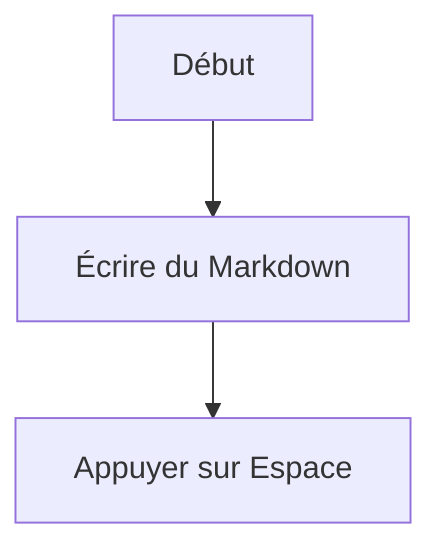

# Guide d'utilisation d'Osh (Débutant)

Ce guide est destiné aux **utilisateurs au quotidien** : obtenez votre premier aperçu réussi en moins d'une minute, puis résolvez les problèmes du plus simple au plus complexe.

> Si vous êtes développeur et cherchez des diagnostics en ligne de commande ou des détails avancés, consultez directement :
> - Dépannage avancé : [`TROUBLESHOOTING.md`](TROUBLESHOOTING.md)

---

## 1) Vérifier que cela fonctionne

1. Trouvez un fichier `.md` dans le Finder
2. Sélectionnez-le et appuyez sur **Espace**
3. Vous devriez voir un aperçu Markdown stylisé (et non du texte brut)

Si cette étape a fonctionné, tout le reste ci-dessous est facultatif.

---

## 2) Configuration initiale (recommandée)

### Étape A : Lancez l'application une fois (important)

macOS n'enregistre généralement une extension Quick Look qu'après l'ouverture de son application hôte au moins une fois.

1. Ouvrez **Applications**
2. Lancez **Osh** une fois
3. Voir la fenêtre de bienvenue suffit (pas besoin de choisir un fichier)

### Étape B : Assurez-vous que l'extension Quick Look est activée

Si appuyer sur Espace affiche toujours l'ancien aperçu :

1. Ouvrez **Réglages Système**
2. Allez dans **Extensions** → **Quick Look**
3. Assurez-vous que l'élément **Osh / OshQuickLook** est activé

---

## 3) Problèmes courants (du simple au plus complexe)

### 3.1 Appuyer sur Espace ne fait « rien »

Essayez chacune de ces étapes dans l'ordre :

1. **Relancez le Finder** : clic droit sur l'icône Finder dans le Dock (maintenir Option enfoncée) → Relancer
2. **Videz le cache QuickLook** : ouvrez le Terminal et exécutez :

```bash
qlmanage -r
qlmanage -r cache
killall Finder
```

Retournez ensuite dans le Finder et réessayez avec Espace.

### 3.2 « L'application est endommagée / impossible de vérifier le développeur »

C'est la sécurité Gatekeeper de macOS.

Exécutez ceci dans le Terminal :

```bash
xattr -cr "/Applications/Osh.app"
```

Puis rouvrez l'application.

### 3.3 L'aperçu s'ouvre, mais affiche parfois du texte brut

Généralement, le système a choisi un autre plugin QuickLook ou a un cache obsolète.

1. Videz d'abord le cache en suivant l'étape **3.1**
2. Vous pouvez également définir Osh comme gestionnaire par défaut des fichiers `.md` : clic droit sur le fichier → Lire les informations → Ouvrir avec

Si le problème persiste, consultez le guide avancé : [`TROUBLESHOOTING.md`](TROUBLESHOOTING.md)

---

## 4) Utilisation de l'application (ouvrir des fichiers / glisser-déposer / réglages)

### Ouvrir des fichiers

- Option 1 : double-cliquez sur un fichier `.md` (si Osh est le gestionnaire par défaut)
- Option 2 : cliquez sur **+** au centre de la fenêtre d'accueil et sélectionnez un fichier
- Option 3 : faites glisser un fichier directement sur la zone d'accueil

### Ouvrir les réglages

- Raccourci clavier : **Cmd + ,**
- Ou cliquez sur **Réglages** dans la fenêtre d'accueil

---

## 5) Conseils : rédiger du Markdown avec de superbes rendus

Osh prend en charge Mermaid, KaTeX, GFM et plus encore. Voici quelques exemples prêts à l'emploi :

### Mermaid



### KaTeX

En ligne : `$E = mc^2$`

Bloc :

```tex
\int_a^b f(x)\,dx
```

---

## 6) Besoin d'aide supplémentaire ?

1. Lisez le guide de dépannage avancé : [`TROUBLESHOOTING.md`](TROUBLESHOOTING.md)
2. Pour signaler un problème :
   - Problèmes GitHub : <https://github.com/Zeyadistired/Osh/issues>
