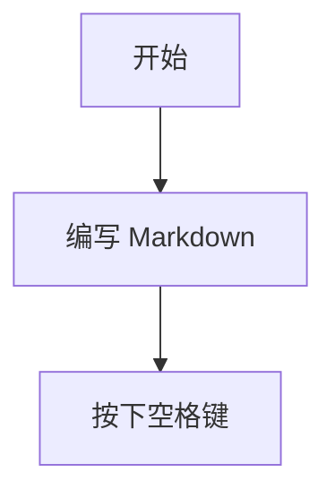

# Osh 用户指南（新手入门）

本指南面向**日常用户**：在一分钟内获得首次成功的 Markdown 预览，并按由易到难的顺序解决常见问题。

> 如果您是开发者并需要命令行诊断与底层细节，请直接查阅：
> - 高级故障排除：[`TROUBLESHOOTING.md`](TROUBLESHOOTING.md)

---

## 1) 验证运行状态

1. 在访达（Finder）中找到任意 `.md` 文件
2. 选中并按下**空格键（Space）**
3. 您应该会看到美观排版的 Markdown 预览（而非纯文本）

如果该步骤已生效，以下内容可根据需要选择阅读。

---

## 2) 首次配置（推荐流程）

### 步骤 A：启动一次应用程序（重要）

macOS 通常只有在宿主应用程序首次打开后才会注册其 QuickLook 扩展。

1. 打开**应用程序**文件夹
2. 启动 **Osh** 一次
3. 看到欢迎界面即可（无需主动选择文件）

### 步骤 B：确认 Quick Look 扩展已启用

如果按空格键仍显示旧版或无样式预览：

1. 打开**系统设置**
2. 前往**扩展** → **快速查看（Quick Look）**
3. 确保 **Osh / OshQuickLook** 已勾选启用

---

## 3) 常见问题（简单 → 深入）

### 3.1 按空格键无反应

请依次尝试以下操作：

1. **重新启动访达**：按住 Option 键右键点击 Dock 中的访达图标 → 重新开启
2. **清除 QuickLook 缓存**：打开终端并运行：

```bash
qlmanage -r
qlmanage -r cache
killall Finder
```

然后回到访达再次按下空格键测试。

### 3.2 提示「已损坏 / 无法验证开发者」

这是 macOS Gatekeeper 安全机制拦截。

在终端中运行：

```bash
xattr -cr "/Applications/Osh.app"
```

然后重新打开应用程序。

### 3.3 预览可以打开，但有时变成纯文本

通常是系统选用了其他插件或缓存过旧。

1. 先按照 **3.1** 步骤清理缓存
2. 可选：将 Osh 设为 `.md` 的默认打开方式（右键文件 → 显示简介 → 打开方式）

若仍有问题，请参阅高级指南：[`TROUBLESHOOTING.md`](TROUBLESHOOTING.md)

---

## 4) 使用应用程序（打开文件 / 拖放 / 设置）

### 打开文件

- 方式 1：双击 `.md` 文件（若已关联）
- 方式 2：点击欢迎窗口中心的 **+** 按钮选择文件
- 方式 3：直接将文件拖拽至欢迎窗口中

### 打开设置

- 快捷键：**Cmd + ,**
- 或点击欢迎窗口底部的**设置**

---

## 5) 提示：编写美观的 Markdown

Osh 支持 Mermaid、KaTeX、GFM 等丰富语法：

### Mermaid 图表



### KaTeX 公式

行内公式：`$E = mc^2$`

块级公式：

```tex
\int_a^b f(x)\,dx
```

---

## 6) 需要更多帮助？

1. 查阅高级故障排除指南：[`TROUBLESHOOTING.md`](TROUBLESHOOTING.md)
2. 提交反馈与问题：
   - GitHub Issues: <https://github.com/Hyp4tia/Osh/issues>
